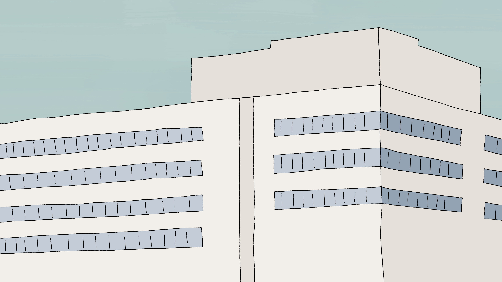
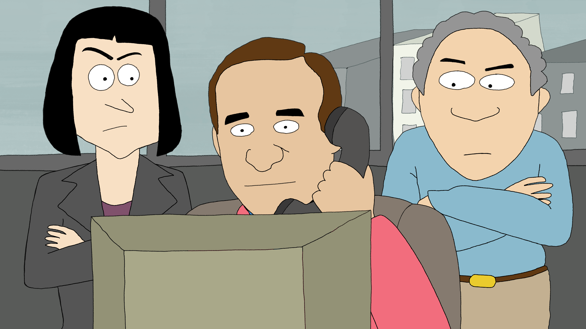
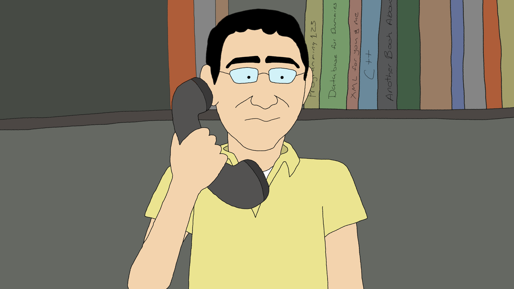
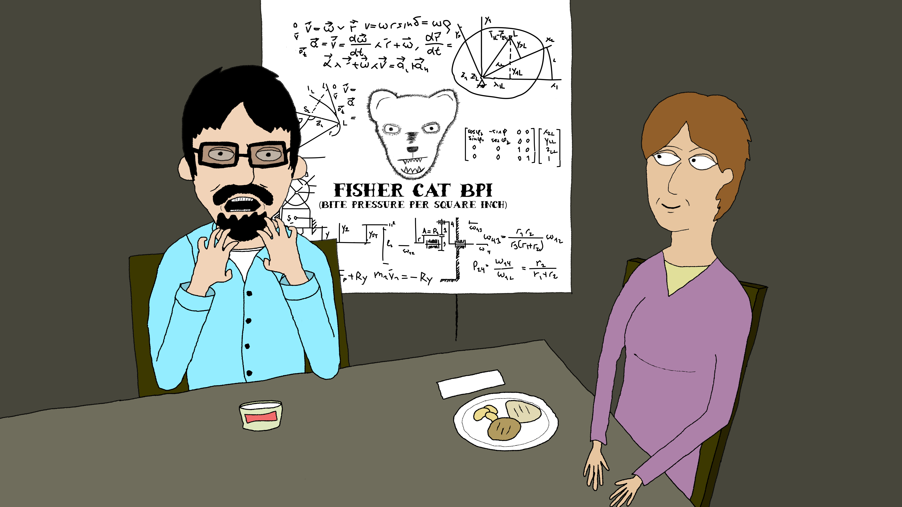
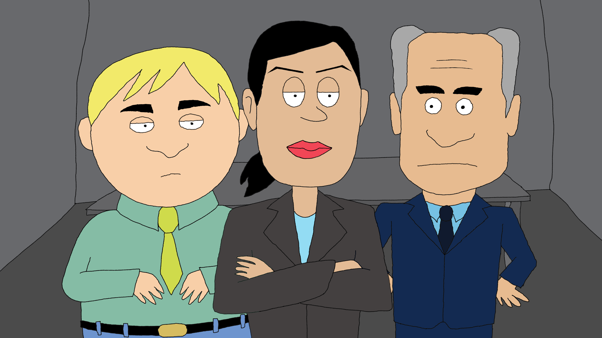

import katzV01 from './01_Katz_V01.mp4';
import katzV01Poster from './01-katz-v01-poster.jpg';
import katzPoc from './02_Katz_POC.mp4';
import katzPocPoster from './02-katz-poc-poster.jpg';
import katzLunchV01 from './03_Katz_Lunch_V01.mp4';
import katzLunchV01Poster from './03-katz-lunch-v01-poster.jpg';
import adviceV01 from './04_Advice_V01.mp4';
import adviceV01Poster from './04-advice-v01-poster.jpg';

I loved Dr. Katz. We wanted to make some stylized graphics for an internal company video, and this low-fi style really fit the vibe we were looking for.

<Figure plain><Video src={katzV01} poster={katzV01Poster} label="Scene 1" /></Figure>

<Figure plain caption="Proof of concept"><Video src={katzPoc} poster={katzPocPoster} label="Scene 2, proof of concept" /></Figure>

<Figure plain caption="Version 1"><Video src={katzLunchV01} poster={katzLunchV01Poster} label="Scene 3, version 1" /></Figure>

<Figure plain><Video src={adviceV01} poster={adviceV01Poster} label="Scene 4" /></Figure>
