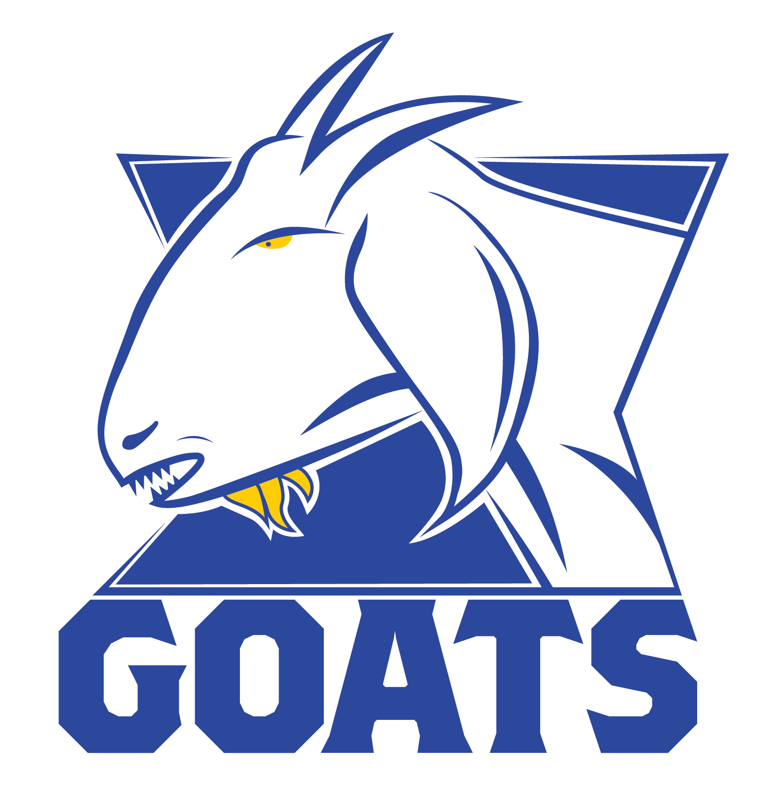
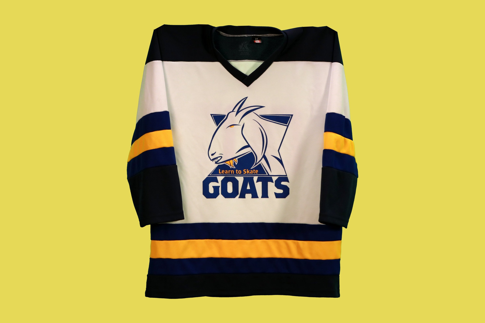
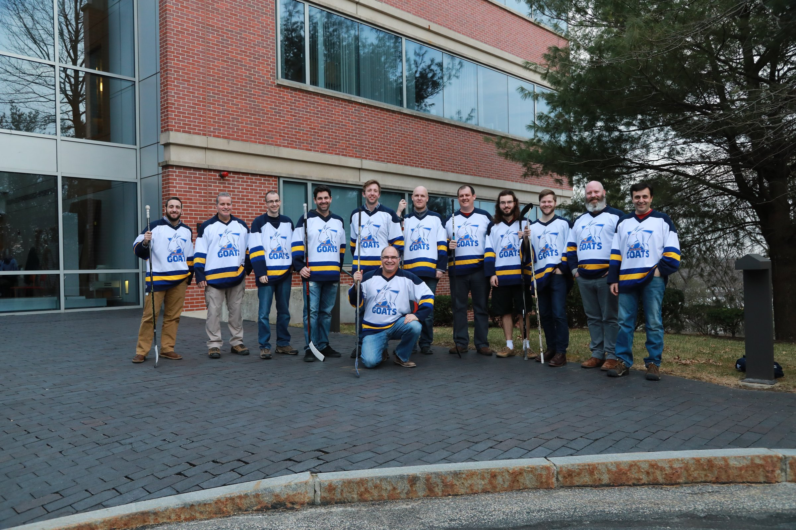
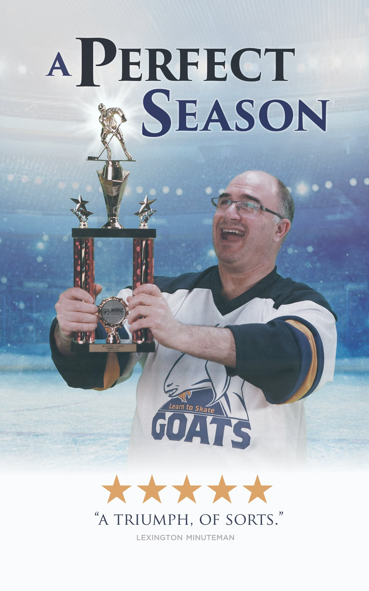

import goatsIntro from './goats-intro.mp4';
import goatsIntroPoster from './goats-intro-poster.jpg';

A co-worker organized a hockey team and asked me to help create an identity for the team. I knew the skill level was mixed with some very new skaters, so I googled "what animal falls down the most". One of the top results was the fainting goat. If you haven't seen these goats, you should stop what you are doing right now and head to your favorite search engine.

So just like that, the Goats were born. We even made a movie! I helped with the intro section which is included below.

<Figure plain><Video src={goatsIntro} poster={goatsIntroPoster} label="Goats intro video" /></Figure>
