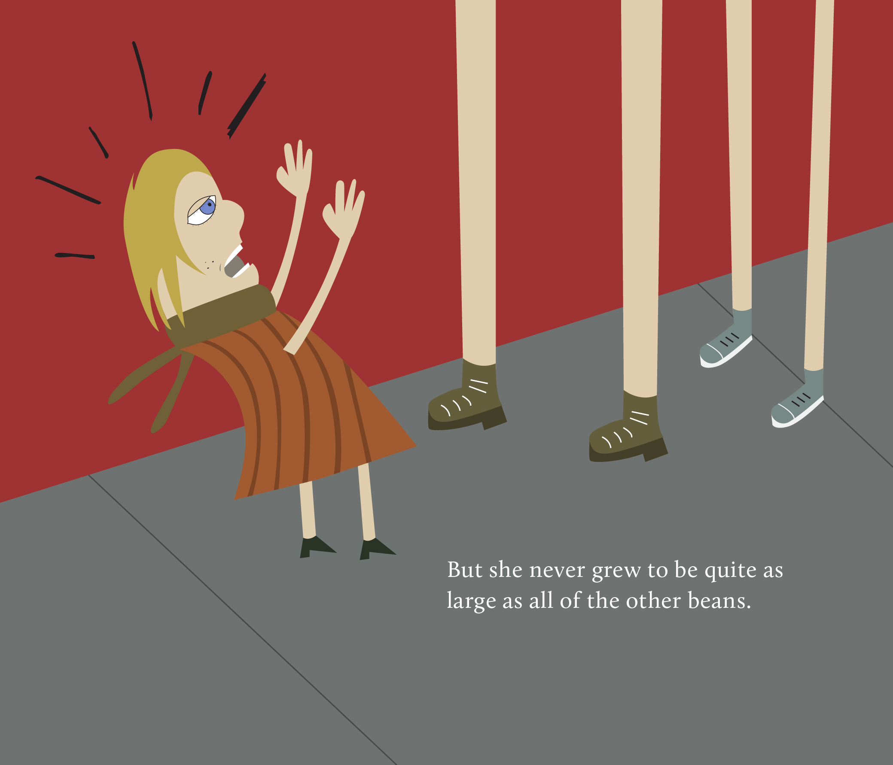
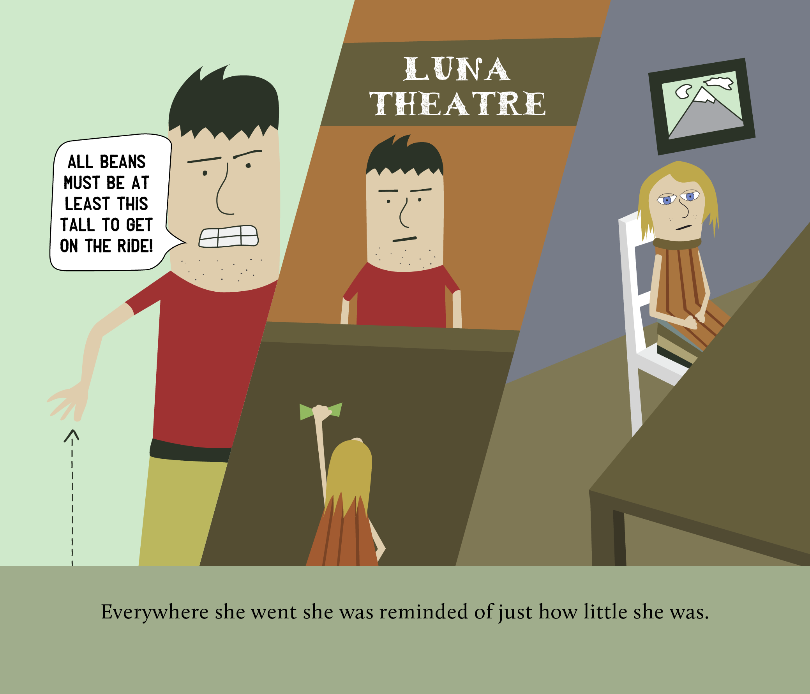
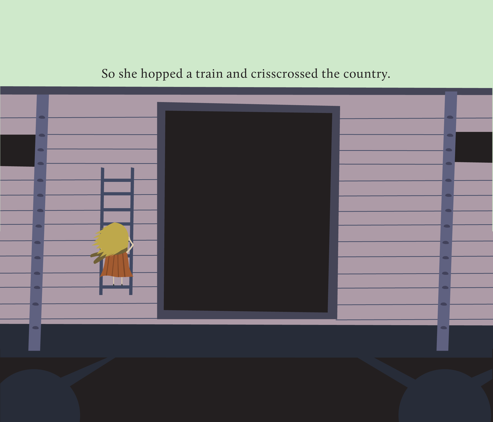
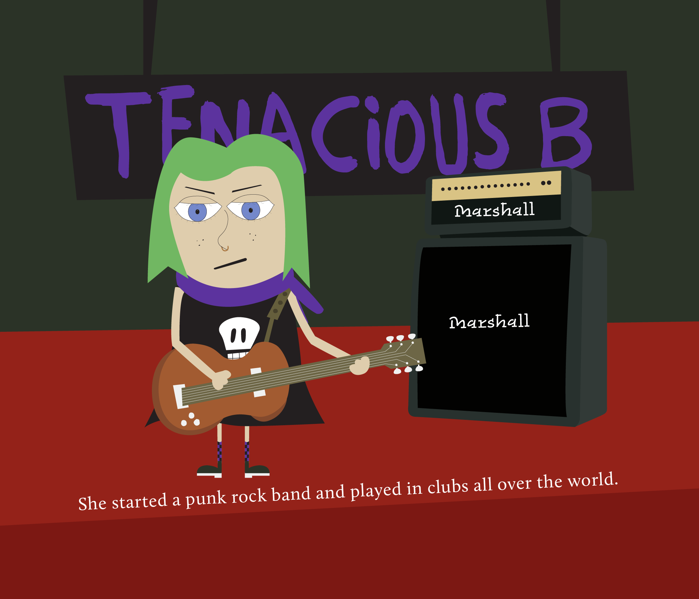
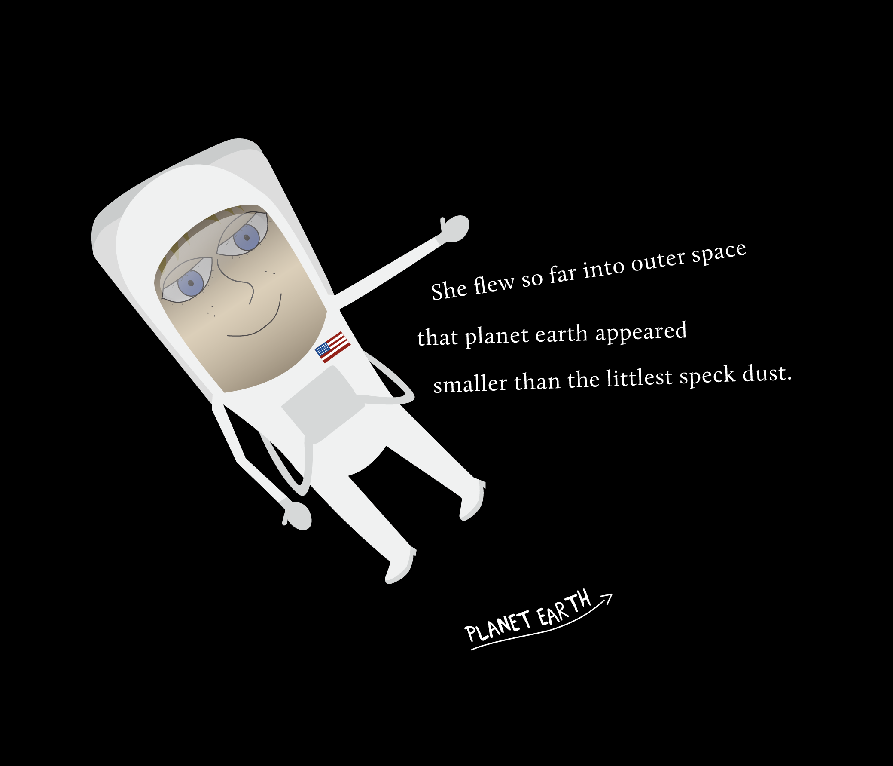
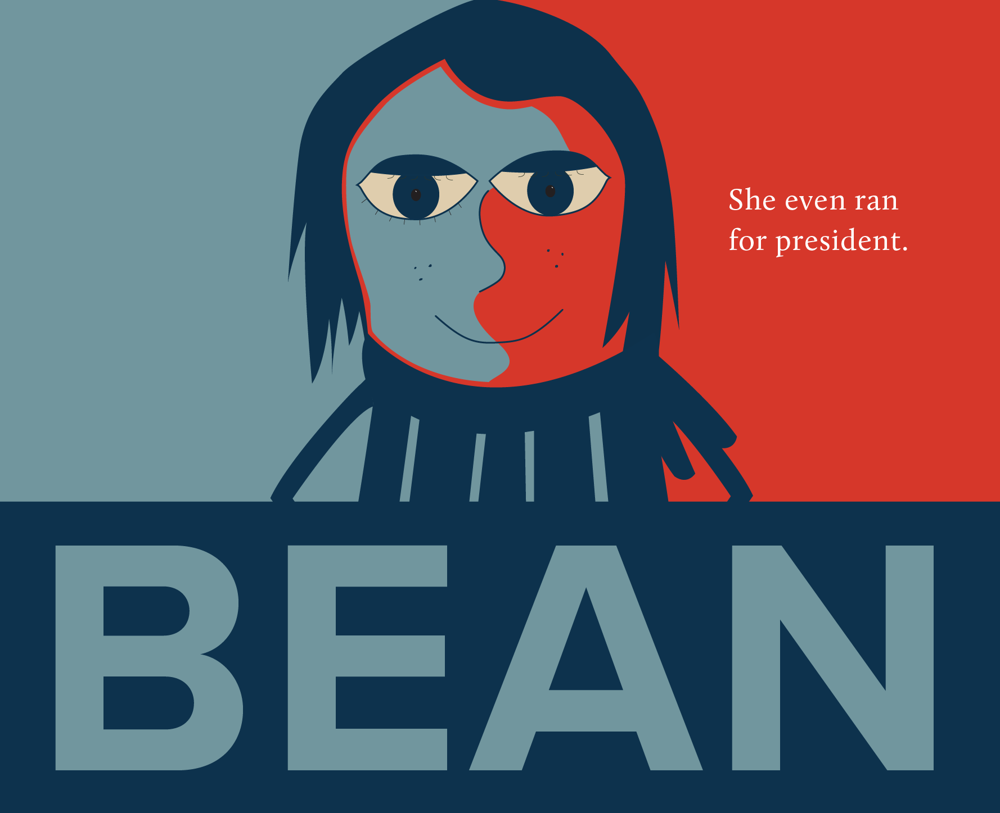

When my niece was born, I made this book for my brother and his wife as a Christmas gift. The story catalogues the life of the tiny Beatrice Bean as she fearlessly tackles adventures of all sizes. 

I made the book in a few weeks, so some of the illustrations were a bit thrown together. I did like a bunch of them included here.

